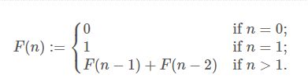
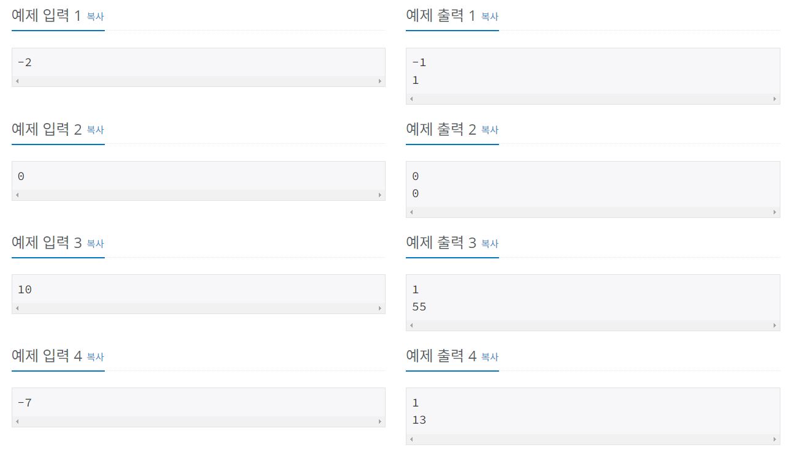

## 문제

수학에서, 피보나치 수는 위의 점화식과 같이 귀납적으로 정의되는 수열이다. 위의 식에서도 알 수 있듯이, 피보나치 수 F(n)은 0 이상의 n에 대해서만 정의된다.

하지만 피보나치 수 F(n)을 n이 음수인 경우로도 확장시킬 수 있다. 위의 식에서 n > 1인 경우에만 성립하는 F(n) = F(n-1) + F(n-2)를 n ≤ 1일 때도 성립되도록 정의하는 것이다. 예를 들어 n = 1일 때 F(1) = F(0) + F(-1)이 성립되어야 하므로, F(-1)은 1이 되어야 한다.

n이 주어졌을 때, 피보나치 수 F(n)을 구하는 프로그램을 작성하시오. n은 음수로 주어질 수도 있다.

### 입력

첫째 줄에 n이 주어진다. n은 절댓값이 1,000,000을 넘지 않는 정수이다.

### 출력

첫째 줄에 F(n)이 양수이면 1, 0이면 0, 음수이면 -1을 출력한다. 둘째 줄에는 F(n)의 절댓값을 출력한다. 이 수가 충분히 커질 수 있으므로, 절댓값을 1,000,000,000으로 나눈 나머지를 출력한다.

### 입출력 예제

